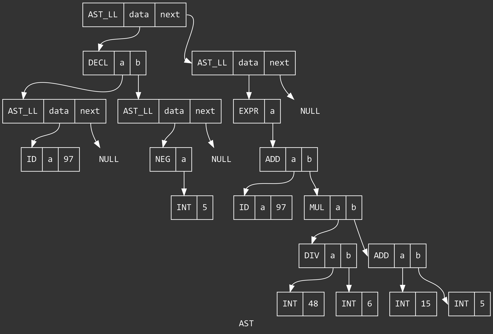

# Aleph

[](https://wakatime.com/badge/github/CrysoK/Aleph)
[](https://github.com/CrysoK/Aleph/actions/workflows/build-windows.yml)
[](https://github.com/CrysoK/Aleph/actions/workflows/test-windows.yml)
[](https://github.com/CrysoK/Aleph/actions/workflows/doxygen.yml)

## Introducción

*Aleph* es un lenguaje de programación experimental diseñado como una herramienta
educativa para aprender los fundamentos del diseño de lenguajes de programación.

Está orientado a estudiantes y desarrolladores interesados en entender los
conceptos fundamentales detrás de los intérpretes y la teoría de lenguajes
formales.

Para obtener más información sobre la sintaxis, la semántica y las
características de *Aleph*, consulta la [documentación](doc/README.md).

## Instalación

### Pre-compilado

Puedes descargar el intérprete listo para usar en Windows [aquí](https://github.com/CrysoK/Aleph/releases).

### Compilar

El único requisito para compilar el intérprete es tener un compilador de C
(recomendado: `gcc`).

Clona o descarga el repositorio. Luego ejecuta el comando del archivo
[`_gcc.cmd`](https://github.com/CrysoK/Aleph/blob/main/_gcc.cmd).

Si se modifican los archivos
[`scanner.l`](https://github.com/CrysoK/Aleph/blob/main/src/flex/scanner.l) o
[`parser.y`](https://github.com/CrysoK/Aleph/blob/main/src/bison/parser.y) se
debe ejecutar `flex` o `bison` respectivamente.

Para facilitar la compilación se puede usar `make`.

## Uso

### REPL

Por defecto se usa el modo REPL (Read-Eval-Print Loop). Permite escribir el
código directamente en la consola y ejecutarlo al presionar `Enter`.

### Archivo

Para ejecutar el contenido de un archivo se debe indicar la ruta (absoluta o
relativa) del mismo al final de los argumentos del intérprete.

```bash
aleph.exe otros_argumentos archivo
```

### Visualización

La opción `-g` permite visualizar el AST con todas las sentencias ejecutadas una
vez que el intérprete finaliza.

En principio se genera un archivo `.dot` con la descripción del AST en lenguaje
[DOT](https://graphviz.org/doc/info/lang.html). Si
[Graphviz](https://graphviz.org/download) está instalado y accesible en el
`PATH`, se usa para crear una imagen en formato `.png`. También se puede usar el
contenido del archivo `.dot` en algún intérprete online como
[este](https://edotor.net/) o
[este](https://dreampuf.github.io/GraphvizOnline/).

Por ejemplo, para el código:

```js
let a = -5
a + 48/6 * (15 + 5)
```

Se genera el AST:



### Otras opciones

- `-h` Muestra un mensaje de ayuda con las opciones disponibles.
- `-c` Deshabilita el color en los mensajes de error y depuración.
- `-d MODOS` Establece los modos de depuración. `MODOS` puede contener:
  - `e` Muestra dónde se crean los mensajes de error.
  - `i` Activa mensajes de depuración del intérprete.
  - `b` Activa la depuración incluida en Bison.
- `-t N` Establece la capacidad máxima de la tabla de símbolos.
- `-s N` Establece la cantidad máxima de "scopes" activos a la vez.
- `-p F` Convierte el AST de vuelta a código y lo guarda en `F` (no implementado).

## Ejemplos

```rust
print("Hola mundo!")
// Python?
```

```rust
// Funciones recursivas
fn Fib(n) {
  if n <= 1 { return n }\
  else { return Fib(n - 2) + Fib(n - 1) }
}
println(Fib(20))
```

```rust
// Funciones como argumento
fn map(f, iter) {
  let new = []
  for e in iter { new += [f(e)] }
  return new
}
fn doble(elem) { return elem * 2 }
let lista = [1, 2, 3, 4]
let dobles = map(doble, lista)
println(dobles)
```
